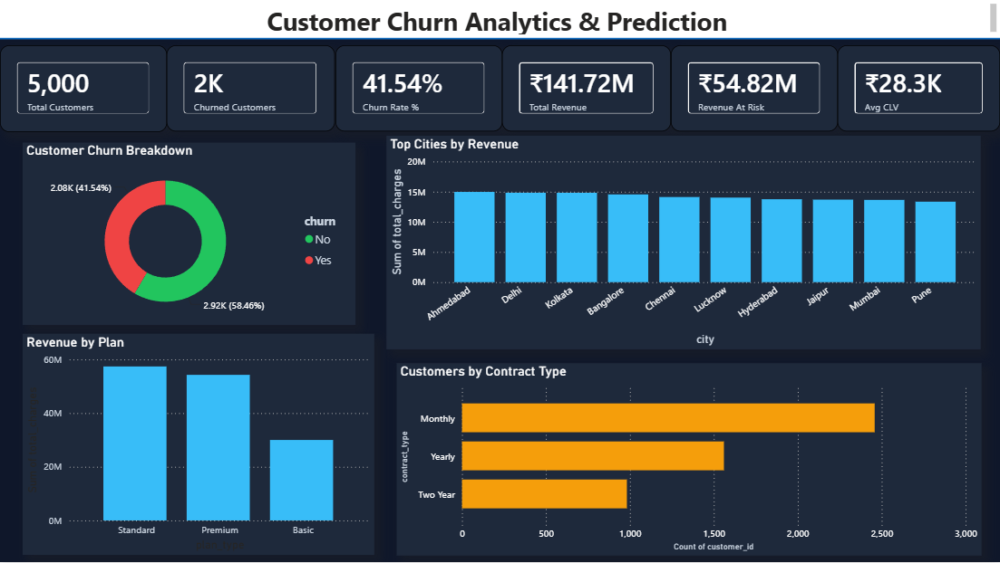
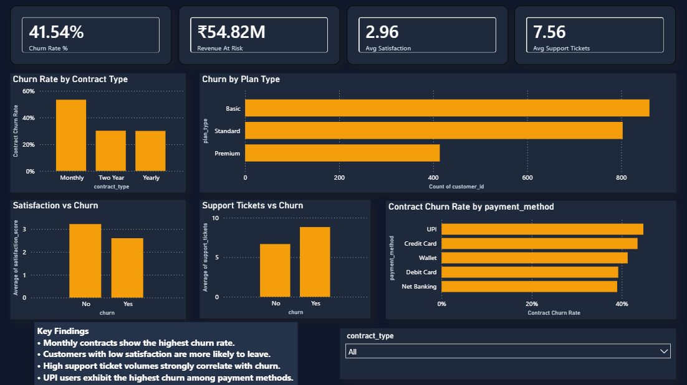
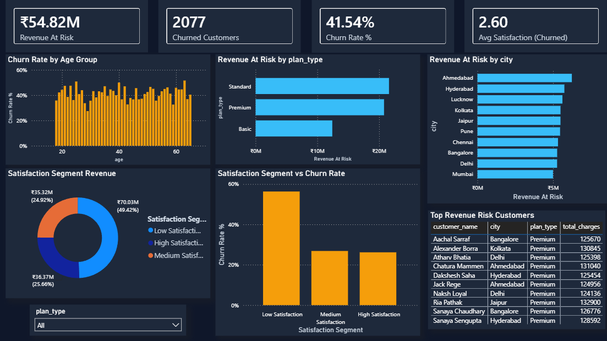

# Customer Churn Analytics Dashboard

## Project Overview

This project analyzes customer churn behavior, customer segments, revenue contribution, and revenue risk using SQL, Python, and Power BI.

The objective is to identify:

- Why customers churn
- Which customer groups generate the most revenue
- Which segments are at higher risk
- Key business drivers influencing customer retention

The project follows an end-to-end analytics workflow:

**SQL → Data Analysis → Business Insights → Power BI Dashboard**

---

## Dataset Information

| Metric | Value |
|---|---:|
| Total Customers | 5,000 |
| Total Features | 15 |
| Churned Customers | 2,077 |
| Churn Rate | 41.54% |
| Total Revenue | ₹141.72 Million |

---

## Tools & Technologies

- SQL
- Python
- Pandas
- Power BI
- DAX
- Git & GitHub

---

## Project Structure

```text
Customer-Churn-Analytics-Dashboard/

├── dataset_generation/
│   └── Dataset generation files
│
├── datasets/
│   └── Customer dataset
│
├── Screenshots/
│   ├── Dashboard screenshots
│   └── Analysis screenshots
│
├── sql_queries/
│   ├── SQL analysis queries
│   └── Business analysis queries
│
├── Customer_churn_Analytics.pbix
│
└── README.md
```


# SQL Analysis

The analysis is divided into five business-focused areas.

### 1. Executive Overview

- Total Customers
- Churned Customers
- Churn Rate
- Total Revenue
- Revenue at Risk
- Average Customer Lifetime Value (CLV)

### 2. Churn Analytics

- Churn by Plan Type
- Churn by Contract Type
- Churn by Gender
- Churn by Payment Method
- Churn by Age Group

### 3. Customer Segmentation

- Regular Customers
- High Value Customers
- VIP Customers
- Segment Revenue Contribution
- Segment-wise Churn Analysis

### 4. Revenue Analysis

- Revenue by City
- Revenue by Plan Type
- Top Revenue Generating Customers
- Revenue Distribution Analysis

### 5. Advanced Churn Intelligence

- Revenue at Risk Analysis
- Satisfaction vs Churn
- Support Tickets vs Churn
- High-Risk Customer Identification


# Power BI Dashboard

The Power BI dashboard provides an interactive view of customer churn, revenue, customer segmentation, and revenue risk.

## Executive Overview

- KPI Cards
- Churn Distribution
- Revenue by Plan Type
- Customers by Contract Type
- Top Cities by Revenue



---

## Churn Intelligence

- Churn Rate by Contract Type
- Churn by Plan Type
- Satisfaction vs Churn
- Support Tickets vs Churn
- Churn by Payment Method



---

## Customer Segmentation & Revenue Analysis

- Revenue by Customer Segment
- Customer Segment Distribution
- Revenue by City
- Segment-wise Churn
- Top Customers Analysis


---

## Advanced Churn Intelligence

- Revenue at Risk
- Churn by Age Group
- Satisfaction Segment Analysis
- Revenue Risk by Plan Type
- High-Risk Customer Analysis


# Key Business Insights

- Monthly contract customers show higher churn compared with customers on longer-term contracts.
- Customers with lower satisfaction scores show higher churn levels.
- Higher support ticket volumes are associated with increased customer churn.
- High-value customers contribute a significant share of overall revenue.
- Customer segments show different churn and revenue patterns.
- A smaller group of customers represents a significant portion of potential revenue risk.
- Churn analysis can help identify high-risk customers and support targeted retention strategies.

---

# Skills Demonstrated

### SQL

- Aggregations
- CASE Statements
- Joins
- Window Functions
- Ranking Functions
- Business Analysis Queries

### Python

- Data Cleaning
- Data Exploration
- Exploratory Data Analysis (EDA)
- Pandas

### Power BI

- Data Modeling
- DAX Measures
- Interactive Dashboards
- KPI Design
- Data Visualization
- Business Storytelling

### Data Analytics

- Customer Churn Analysis
- Customer Segmentation
- Revenue Analysis
- Revenue Risk Analysis
- Business Insights

---

## Author

**Shivam Kumar**

B.Tech — Computer Science & Engineering

**Skills:** SQL | Python | Pandas | Power BI | DAX

GitHub: https://github.com/Shivam-k27
